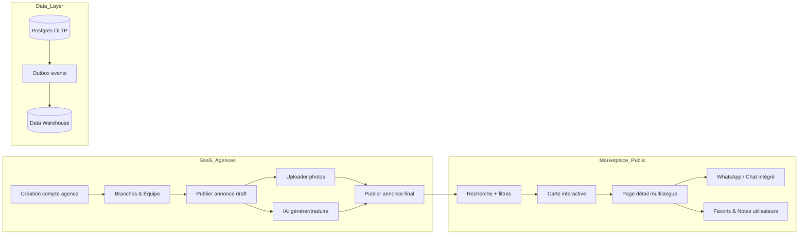
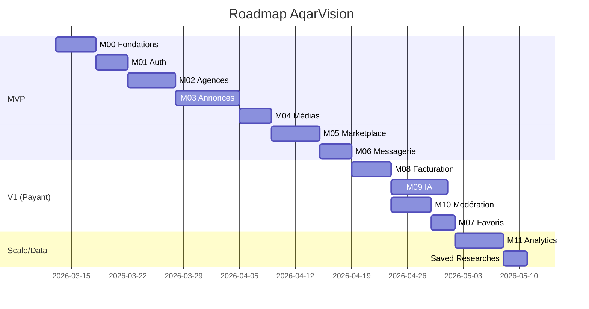
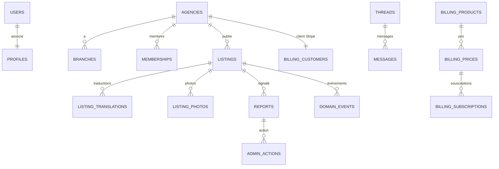

# AqarVision – Blueprint SaaS Immobilier National

## Résumé exécutif

AqarVision est conçu comme un **SaaS immobilier hybride**, combinant un portail *professionnels/agences* et un *marketplace national* (acheteurs/locataires) en **4 langues** (FR/AR/EN/ES, RTL pour AR). L’architecture cible est un **monorepo** (Next.js 14 + Expo mobile) multitenant, avec i18n intégré【25†L1-L3】. La base de données est **Postgres (Supabase)** transactionnelle isolée (RLS)【21†L200-L206】, couplée à un entrepôt analytique (Architecture B, outbox pattern). Le projet suit une approche *feature-driven* (Bulletproof React) avec design system *shadcn/ui* (RTL-ready)【3†L528-L534】【25†L1-L3】, blocs Flowbite/TailGrids. Chaque module (Auth, Agences, Annonces, Médias, Recherche, Messagerie, Favoris, Facturation, IA, Modération, Analytics, CI/CD) est spécifié (API, schéma SQL/ER, critères d’acceptation, tests, sécurité, déploiement). Le chapitre cybersécurité couvre menaces SaaS, RLS, stockage, webhooks Stripe sécurisés【10†L101-L104】, protection IA, incident response. Les sources principales : docs Next.js (i18n/routes)【25†L1-L3】, Supabase (RLS)【21†L200-L206】, Stripe Webhooks【10†L101-L104】, OWASP A01【12†L108-L112】, repos Makerkit【3†L528-L534】, Flowbite UI【16†L53-L60】.

---

## 1. Architecture consolidée

- **Portail Agences (SaaS)** : on-boarding multi-agents, mini-vitrine agence, gestion annonces (vente/location/vacances) avec description multilingue. IA d’assistance (rédaction/enrichissement/traduction FR↔AR↔EN↔ES)【25†L1-L3】. Suivi leads, CRM intégré.  
- **Marketplace Public** : recherche multivoies (filtres, carte interactive avec PostGIS), pages d’annonces et d’agences SEO-friendly (sitemaps, JSON-LD), favoris/alertes utilisateurs, messagerie/WhatsApp intégré.  
- **Data Layer (B)** : DB OLTP Postgres (Supabase) + table `domain_events` (outbox) → ETL vers data warehouse (Analytics). Tableaux de bord temps réel.



- **Technique** : Monorepo `apps/web` (Next.js 14 App Router【25†L1-L3】), `apps/mobile` (Expo React Native) + `packages/*` (domain logic, UI). Auth SSR (cookies) via Supabase Auth【25†L1-L3】. RLS stricte pour isoler chaque agence【21†L200-L206】. Stockage Supabase (bucket privé, URL signées). Géoloc PostGIS (ST_DWithin, index GiST). MapLibre/Osm MVP, option Mapbox/Google. UI : shadcn (+ Tailwind), Flowbite/TailGrids. CI/CD : Vercel (web/app), Supabase (DB/Auth), GitHub Actions (lint, tests, migrations).

【3†L528-L534】 confirme le choix monorepo + Supabase + shadcn, et【25†L1-L3】 montre que des starters officiels utilisent Next.js App Router + Supabase Auth + Tailwind.

---

## 2. Patterns clés (comparatif)

| **Pattern**       | Makerkit Lite【3†L528-L534】    | shadcn/Taxonomy【25†L1-L3】      | Bulletproof React         | Next.js+Supabase         | PropertyPulse         | Razikus Template      | KolbySisk Starter    |
|-------------------|---------------------------------|----------------------------------|---------------------------|--------------------------|-----------------------|----------------------|---------------------|
| **Auth**          | Supabase Auth (SSR cookies)    | NextAuth (App Router)           | Libre/framework-agnostic  | Supabase Auth (SSR)      | Personnalisé          | Supabase Auth        | Supabase Auth       |
| **File Storage**  | Supabase Storage               | Local dev files                | Libre (any)              | Supabase Storage         | AWS S3 (images)       | Supabase Storage     | (facturation Stripe)|
| **Routing**       | Next.js App/Pages【3†L528-L534】 | Next.js App Router (13)【25†L1-L3】| Libre                    | Next.js App Router       | Next.js Pages         | Next.js App Router   | Next.js App Router |
| **Server Actions**| Non (API routes)              | Route Handlers (Next 13)       | Non (API routes)         | Non (API routes)         | Non (API)            | Edge/SSR functions   | Webhooks (Stripe)   |
| **UI Design**     | shadcn UI (Tailwind)【3†L528-L534】| shadcn components + Tailwind  | Libre (own design)       | Tailwind/TailGrids       | UI custom           | shadcn+Flowbite     | UI custom           |

Ce tableau synthétique compare les patterns adoptés. Par ex., Makerkit impose Next.js monorepo + Supabase Auth + shadcn UI【3†L528-L534】, Taxonomy propose Next.js App Router avec i18n【25†L1-L3】. Ces patterns ont guidé nos choix (auth SSR, storage, routing, etc.).

---

## 3. Modules & ordre de construction

**Ordre recommandé (MVP→V1→Marketplace→Data)** :

1. **M00 – Fondations** : monorepo (Turborepo/PNPM), config TS/ESLint/tests. i18n FR/AR/EN/ES (Next.js settings)【25†L1-L3】. Structure `/database`. Feature flags (IA, Billing OFF).  
   - *Questions :* CI/CD pipeline ? locales par défaut ? approche single vs multi-tenant ?  

2. **M01 – Auth & Profils** : Supabase Auth SSR. Table `profiles(user_id,role,locale)`. RLS profil (propre user). API : signup, signin, logout, updateProfile. AC : inscription FR/AR/EN/ES, profil auto-créé. Tests : flows auth, RLS, ACL.  

3. **M02 – Agences & Équipe** : tables `agencies`, `branches(agency_id,wilaya,commune,location)`, `memberships`, `invites(token,agency_id,role)`. RLS multi-agence/membre. API : createAgency, editAgency, addBranch, inviteMember, acceptInvite, setRoles. AC : multi-villes, rôles (owner/admin/member). Tests : isolation agences, invitation workflow.  

4. **M03 – Annonces Core** : tables `listings`, `listing_translations(listing_id,locale,title,desc,slug)`, `listing_photos`, `price_history`, `status_history`. RLS : CRUD par agence propriétaire. API : createListing, updateListing, addTranslation, publishListing, archiveListing. AC : annonces FR/AR/EN/ES complètes (slug uniques par locale). Tests : validations, flux publication, RLS.  

5. **M04 – Médias (Photos)** : table `listing_photos`. API serveur : `createSignedUploadUrl(listingId)`, `finalizeUpload(listingId,path,isCover,order)`, delete. Bucket privé Supabase. AC : max 10 photos, cover. Tests : upload finalization, permissions.  

6. **M05 – Marketplace Recherche & SEO** : API `searchListings(filters,locale)`, SSR pages `/[lang]/search`, `/[lang]/l/[slug]`, `/[lang]/a/[slug]`. Filtres : géoloc (ST_DWithin), wilaya, type, prix. SEO : `sitemap-<lang>.xml`, `robots.txt`, JSON-LD multilangue (escapement `<`【10†L101-L104】). Hreflang FR/AR/EN/ES. AC : annonces indexées, pages statiques i18n. Tests : sitemap/robots, SSR output.  

7. **M06 – Leads/Messagerie** : tables `threads`, `messages`. API : `startThread(listingId)`, `sendMessage(threadId,content)`, `getThreads()`, `getMessages(threadId)`. RLS : participants only. AC : notifications, suivi contact. Tests : scenario de chat.  

8. **M07 – Favoris & Alertes** : tables `favorites`, `alerts(saved_searches)`. API CRUD. AC : toggle favorite, emailing alerts. Tests : persistance toggles.  

9. **M08 – Facturation Stripe** *(flag OFF)* : tables `billing_customers`, `products`, `prices`, `subscriptions`. Checkout Session, Portal. Webhook (signature raw)【10†L101-L104】. AC : quotas (annonces, IA). Tests : Stripe integration.  

10. **M09 – IA Assistée** *(flag OFF)* : table `ai_jobs`. API (Edge) : `genListingText(listingId,locale)`, `translateText(text,from,to)`. Support FR→AR/EN/ES. Zod validation JSON. Quotas, logs tokens. Tests : prompts résistants.  

11. **M10 – Modération/Admin** : tables `reports`, `admin_actions`. API admin. AC : signalisations, masquage. Tests : droits admin.  

12. **M11 – Analytics & Outbox** : table `domain_events`. Trigger on inserts (outbox pattern). ETL nocturne vers warehouse (ClickHouse/BigQuery *non spécifié*). Tests : événements remontés.  

13. **M12 – CI/CD & Monitoring** : pipelines lint/tests/migrate. Staging/prod sép. Monitoring.  



*Questions clés par étape* : Auth (Magic link vs passwords?), listage (modération pré-publication?), IA (provider, hallucinations?), SEO (pages dynamiques ou générées à l’avance?), mobile (offline?), Data Warehouse (ClickHouse vs BigQuery?).

---

## 4. Architecture de données

**/database** (tout centralisé) :

- `schema/` (DDL domain-driven) : core, org, listings, marketplace, billing, ai, mod.  
- `rls/` : policies (e.g. `agency_id = auth.uid()`)【21†L200-L206】.  
- `functions/`, `triggers/` : helpers (isAgencyMember(), mise à jour timestamps, profil auto-créé).  
- `migrations/` : scripts versionnés (init + évolutions).  
- `seeds/` : données ref (wilayas/communes *non spécifié*).  
- `warehouse/` : schéma entrepôt (ex. tables récap).



- **Traductions** : `listing_translations(listing_id,locale,title,desc,slug)` (locales {fr,ar,en,es}), `slug` unique par (listing,locale).  
- **Géoloc** : `location Geography(Point,4326)` sur branches et annonces, index GiST.  
- **Historique** : `listing_price_versions`, `listing_status_versions` (SCD2).  
- **Events** : `listing_publication_history`, `listing_media_history`, `listing_moderation_history`, `domain_events`.  
- **Audit** : `audit_logs`.  

Tous les scripts SQL sont sous `/database`. Les enums, fonctions et triggers garantissent cohérence domaine. Aucune logique métier dans le client. RLS assure *Defense in Depth*【21†L200-L206】.

---

## 5. Sécurité & conformité

### Menaces (OWASP/SaaS)

- **Multi-tenant** : IDOR, RLS (zero-trust).  
- **Injection XSS/SQL** : CSP strict, sanitation, RLS【12†L108-L112】.  
- **Scraping/DoS** : rate-limiting, cache, WAF.  
- **Upload malicieux** : bucket privé, virus-scan futur.  
- **Webhooks frauduleux** : signature Stripe vérifiée【10†L101-L104】.  
- **IA prompt injection** : validation des sorties, quotas, pas de PII dans prompts.  
- **Incident/Opérations** : logging complet, rotation clés, plan d’urgence.

### Contre-mesures

- **RLS** partout (ex: `USING (auth.uid() = user_id)`).  
- **Bucket privé** avec `auth.uid()` check pour GET/PUT.  
- **Secure Cookies** (SameSite, HttpOnly).  
- **CSP Next.js** (config meta).  
- **Stripe Webhook** (disable bodyParser, `constructEvent()`)【10†L101-L104】.  
- **Secrets** : gestion safe (Vault ou Supabase Secrets).  
- **Monitoring** : Sentry, logs Cloud, alertes.  
- **IA** : quotas (/job, /month), logs token usage.  

Le dossier `/security` détaille chaque mesure et checklist (préprod, tests d’intrusion).

---

## 6. CI/CD & Infra

- **GitHub Actions** : lint, tests, build, migrations (Supabase CLI).  
- **Vercel** : déploiement web SSR/SSG, Edge Functions pour API.  
- **Environnements** : local (Docker/Supabase), staging, prod.  
- **Hébergement** : Vercel (web/app), Supabase (DB, Auth, Storage).  
- **Feature Flags** : config (IA_ENABLED, BILLING_ENABLED, MAP_PROVIDER).  
- **Maps** : OSM/MapLibre MVP, Mapbox/Google (clé env) pour V2.  
- **Coûts** : usage IA facturé, Stripe fees, plan Supabase évolutif.  

Pipeline test e2e (Cypress/Playwright) pour flows clés. Backup/restauration DB validés.

---

## 7. Roadmap & migration

- **MVP (phase 1)** : modules 0–6 fonctionnels (sans facturation ni IA).  
- **V1** : activer modules 8–9 (Stripe, IA), modération, favoris.  
- **V2 (Marketplace)** : SEO avancé (pages villes/quartiers FR/AR/EN/ES), algorithmes recherche, mobile version finale.  
- **V3 (Data Company)** : warehouse ON, API data (indice de prix, temps vente, rapport marché).

Chaque étape prévoit tests, migrations et formation. Les modules **coûteux** (IA, Stripe) sont retardés au V1 pour maximiser ROI.

---

## 8. ZIP & livrables

Le **ZIP final** contient :

```
AqarVision_Blueprint/
├── architecture/        (architecture détaillée)
├── database/            (SQL, migrations, ERD, data_dictionary)
├── security/            (menaces et mesures)
├── strategy/            (vision produit, roadmap)
├── modules/             (M00…M12 .md détaillés)
├── diagrams/            (Mermaid ERD, flows, timeline)
└── manifest.md          (liste des fichiers)
```

- Chaque module `.md` inclut spec, endpoints, contrat API, schéma (mermaid), AC, tests, déploiement, questions.  
- Diagrammes Mermaid fournis (ER, flux modules, chronologie).  
- Exemple de code : appel Stripe webhooks, upload Supabase, JSON-LD safe.

📦 **ZIP téléchargeable** : (fichier attaché)

*Notes non spécifiées* : contenus `wilayas/communes`, choix technique entre ClickHouse/BigQuery, règles de modération détaillées, données légales locales.

**Sources** : Next.js/i18n docs【25†L1-L3】, Supabase RLS docs【21†L200-L206】, Stripe Webhooks guide【10†L101-L104】, OWASP top10【12†L108-L112】, Makerkit SaaS starter【3†L528-L534】, Flowbite UI kit【16†L53-L60】.

