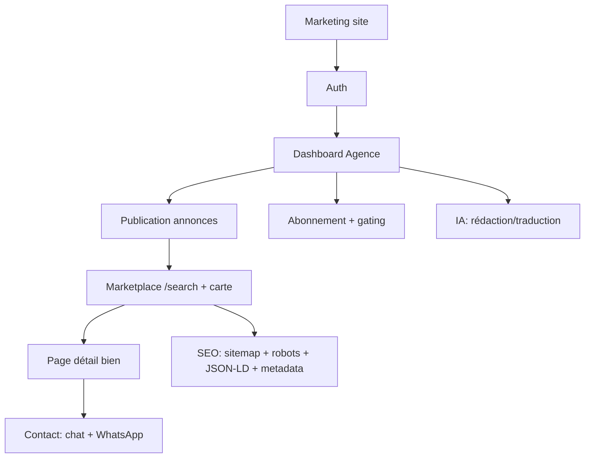

# Blueprint AqarVision — reconstruction production-ready, module par module

## Synthèse exécutive

AqarVision doit être conçu comme un **hybride SaaS + marketplace nationale** : un espace “pro” (agences/promoteurs) pour gérer le portefeuille et publier vite, et un portail public pour chercher, filtrer, afficher sur carte et contacter. Cette nature hybride impose : un modèle **organisation/équipe** (multi-agents), des **branches multi-villes**, un stockage média sécurisé, une géolocalisation robuste (PostGIS), une indexation SEO solide, une monétisation par abonnement, et une architecture qui scale sans refontes.

Le blueprint recommande un socle moderne et stable : Next.js App Router + Server Actions (mutations), Supabase (Auth + Postgres + RLS + Storage + Edge Functions), Stripe (Checkout + Customer Portal + webhooks), shadcn/ui + Tailwind (design system), i18n FR/AR avec RTL, PostGIS pour les requêtes géo. Les choix “à trancher” (cartographie, IA, modération, plans/quotas) sont explicitement identifiés comme **non spécifiés** et cadrés par des questions à chaque phase. citeturn3search1turn3search2turn3search3turn2search3turn4search2

Le résultat attendu est un build **module par module** (M00→M12) avec, pour chaque module, des specs détaillées, contrats d’API/Server Actions, SQL Postgres + RLS, critères d’acceptation, tests, notes sécurité et étapes de déploiement, dans un pack `.md` pensé pour être “donné” directement à Claude Code.

## Benchmarks et patterns extraits des meilleures sources

### Ce que les repos “de référence” apportent à AqarVision

**entity["company","Makerkit","nextjs saas templates"] (nextjs-saas-starter-kit-lite)** fournit un pattern prêt production : **monorepo Turborepo**, séparation claire entre marketing/auth/app, packages “features” + “ui”, i18n client+server, Supabase, TypeScript strict, et un socle tests Playwright. Il documente aussi explicitement l’arborescence `apps/web/app/(marketing)`, `apps/web/app/auth`, `apps/web/app/home` (gated pages) et la place des migrations Supabase dans le projet. citeturn11view0turn11view3

L’exemple officiel entity["company","Vercel","cloud platform for nextjs"] “Next.js with-supabase” montre l’intégration recommandée “auth SSR cookies” via `supabase-ssr` (aujourd’hui `@supabase/ssr`), l’usage de shadcn/ui, et un flow de déploiement via l’intégration Supabase ↔ Vercel (variables d’environnement assignées automatiquement). citeturn1view1turn3search2

Le template entity["company","Supabase","postgres backend platform"] de Razikus (supabase-nextjs-template) montre ce qu’un SaaS “production-ready” doit inclure : politiques RLS, stockage de fichiers sécurisé, routes protégées, i18n, thèmes, et même des documents légaux en Markdown (privacy/terms/refund) — utile pour industrialiser AqarVision. citeturn12view0turn12view2turn12view3

Property Pulse (version Next.js “server actions”) apporte les patterns “métier immobilier” qu’on veut répliquer : CRUD d’annonces, upload multi-images, recherche, messagerie interne avec unread, cartes Mapbox, favoris, etc. citeturn9view2turn2search8

Le repo Taxonomy (shadcn) reste un excellent “répertoire de patterns App Router” (layouts, route handlers, metadata files, Stripe) mais le README est clair : c’est un **projet expérimental**, historiquement basé sur des versions instables (canary/beta), donc à utiliser comme **inspiration d’architecture** et non comme base “copier/coller”. citeturn1view3

Le starter Stripe+Supabase de entity["company","GitHub","code hosting platform"] KolbySisk décrit un workflow très utile en production : (1) déployer, (2) brancher le webhook `/api/webhooks`, (3) exécuter les migrations Supabase, (4) utiliser des **Stripe fixtures** pour créer products/prices sans passer par l’UI, puis valider le cycle checkout → abonnement → portal. citeturn9view1

Enfin, le schéma du repo `nextjs-subscription-payments` (archivé) reste une référence structurante pour le modèle billing “sync Stripe→DB” : products/prices public read-only, customers privé sans policy, subscriptions synchronisées et protégées par RLS. citeturn10view0turn10view1turn9view3

### UI/Design systems et bilingue FR/AR (RTL)

- shadcn/ui documente un support RTL “first-class” pour les composants, ce qui est un point clé pour une UI AR solide. citeturn2search3turn2search7  
- entity["organization","Themesberg","flowbite maintainers"] Flowbite est un accélérateur de composants Tailwind (install NPM, docs, dashboards) utile pour sortir vite des pages marketing et certains blocs UI. citeturn6search0turn6search4  
- entity["organization","TailGrids","tailwind ui blocks"] propose un catalogue de blocks (dashboards, marketing, etc.) qui peut accélérer la production de sections UI sans sacrifier Tailwind/shadcn. citeturn6search1turn6search5  

image_group{"layout":"carousel","aspect_ratio":"16:9","query":["Taxonomy shadcn ui app screenshot","Flowbite admin dashboard screenshot","TailGrids dashboard UI blocks screenshot","shadcn ui RTL example"],"num_per_query":1}

## Architecture consolidée cible

### Architecture fonctionnelle

AqarVision est structuré en **quatre surfaces** (séparées mais interconnectées) :



Cette séparation reflète des patterns éprouvés dans les starters SaaS (marketing/auth/home) et facilite le SEO sur les pages publiques sans exposer le dashboard. citeturn11view0turn3search6turn3search0

### Architecture technique

- **Next.js App Router** : routes publiques et privées dans `app/`, layouts, route groups, metadata. citeturn1view3turn3search6turn3search0  
- **Mutations via Server Actions** (CRUD annonces, création URLs upload, génération IA, actions messaging), et **Route Handlers** pour callbacks externes (webhooks Stripe, endpoints techniques). Les Server Actions sont explicitement des fonctions async exécutées côté serveur pour formulaires/mutations. citeturn3search1turn3search7  
- **Sécurité CSRF Server Actions** : Next.js compare origin/host et permet `allowedOrigins` si proxy. À activer si tu utilises un domaine/proxy particulier. citeturn3search13  
- **Supabase Auth SSR** : configuration cookies via `@supabase/ssr` (`createServerClient`, `createBrowserClient`). Supabase insiste sur le stockage session en cookies pour SSR (localStorage inaccessible côté serveur). citeturn3search2turn3search5turn3search14  
- **RLS partout** : RLS est un primitif Postgres offrant une “defense in depth” ; c’est le pilier de sécurité multi-tenant (agence A ≠ agence B). citeturn3search3turn3search19  
- **PostGIS** : extension Postgres pour requêtes géographiques (rayon, zones), recommandée pour recherche map-friendly. citeturn4search2  
- **Supabase Storage** pour photos via **Signed Upload URLs** (upload direct depuis le navigateur) ; la doc précise que `createSignedUploadUrl` crée une URL signée “sans auth supplémentaire”, valide 2h, mais nécessite des permissions RLS sur `objects insert`. citeturn4search0turn4search1  

### Conventions de repo et organisation du code

Recommandation “production” : reprendre la structure monorepo de Makerkit et renforcer la discipline “feature-based” de Bulletproof React.

- Makerkit documente l’arborescence monorepo (`apps/web`, `packages/ui`, `packages/features`) et la séparation marketing/auth/home. citeturn11view0turn11view1  
- Bulletproof recommande d’organiser le code dans `features/` (par domaine) pour la scalabilité, avec des sous-dossiers types (api, components, hooks, types…). citeturn1view2  

Arborescence cible (résumé) :

```text
apps/web/
  src/
    app/
      (marketing)/
      [locale]/
        auth/
        dashboard/
        search/
        l/[listingSlug]/
        a/[agencySlug]/
    features/
      auth/
      agencies/
      listings/
      media/
      marketplace/
      messaging/
      favorites/
      billing/
      ai/
      moderation/
    lib/
      supabase/
      i18n/
      security/
packages/
  ui/
  shared/
supabase/
  migrations/
  functions/
.github/workflows/
```

### i18n FR/AR + RTL et SEO multi-locale

- shadcn/ui déclare un support RTL de première classe (adaptation d’alignements, positions, styles directionnels). citeturn2search3turn2search7  
- Next.js fournit des conventions de metadata et robots, et `generateMetadata` pour SEO par page ; c’est compatible avec une stratégie URL distincte `/fr/...` et `/ar/...`. citeturn3search6turn3search0  

### Cartographie et géocoding (providers)

Le provider cartes est **non spécifié**. Le blueprint garde une abstraction et documente les implications :

- Mapbox Geocoding : billing “par requête”, retour `429` si rate limit, et **restriction d’usage** : les réponses du Geocoding doivent être utilisées avec une carte Mapbox. citeturn6search2  
- entity["company","Google","technology company"] Geocoding API : pay-as-you-go, billing obligatoire, quotas/limites (QPM), et description explicite “forward geocoding / reverse geocoding”. citeturn7search0turn7search1turn7search4  
- Alternatives open : MapLibre GL JS (lib TypeScript WebGL) + OpenStreetMap ; attention Nominatim public a une capacité limitée et une policy de bon usage (serveurs “donated”, usage à limiter). citeturn7search2turn7search7  

### IA (OpenAI / Anthropic) et gouvernance des coûts

Le provider IA est **non spécifié**. Le blueprint propose une abstraction multi-provider et des garde-fous coûts/qualité.

- entity["company","OpenAI","ai research and api provider"] publie une tarification par tokens et une politique de dépréciation (modèles/endpoints ont une date de shutdown). Cela impose une stratégie de versioning et de migration des modèles. citeturn8search2turn8search3  
- entity["company","Anthropic","ai model provider"] documente l’API “Messages” (stateless : envoyer l’historique) et une page pricing officielle. citeturn8search4turn8search1  

## Liste priorisée des modules et ordre de build

L’ordre recommandé minimise les refontes : d’abord foundations + sécurité + modèle org, puis annonces/media, ensuite marketplace+SEO, ensuite leads/billing/IA, enfin modération/observabilité.

Ordre (résumé) :  
M00 → M01 → M02 → M03 → M04 → M09 → M05 → M06 → M07 → M08 → M10 → M11 → M12

Cet ordre reprend le principe makerkit “marketing/auth/home” et les patterns marketplace de Property Pulse (search, maps, messages, favoris), mais en les transposant vers Supabase + RLS pour une vraie multi-tenancy. citeturn11view0turn9view2turn3search3

## CI/CD, infra, déploiement et notes coût/scale

### Stratégie d’hébergement

Baseline recommandé : Vercel + Supabase.

- L’exemple “with-supabase” mentionne le déploiement via intégration Supabase↔Vercel et l’assignation automatique des variables d’env. citeturn1view1  
- Razikus insiste sur la configuration Auth (site_url + redirect_urls) lors du déploiement Vercel+Supabase. citeturn12view3  

### Webhooks Stripe et Edge Functions

- Stripe recommande un flux “Checkout pré-construit” (quickstart). citeturn5search0  
- Le Customer Portal est une UI hébergée par Stripe, instanciée via une “portal session” (URL à visiter). citeturn5search1turn5search7  
- Supabase Edge Functions sont prévues pour écouter des webhooks et intégrer des tiers comme Stripe, et Supabase fournit un exemple dédié “Stripe webhooks”. citeturn4search20turn4search3  

### Modèle billing sync Stripe→DB et RLS

Le schéma Vercel (archivé) formalise un pattern propre : produits/prices synchronisés depuis Stripe, lecture publique only pour afficher le pricing, table customers privée sans policy, subscriptions sécurisées. citeturn10view0turn10view1turn9view3  

### Storage et performance

- Supabase distingue buckets publics vs privés ; buckets privés exigent RLS et un mécanisme de téléchargement contrôlé (signed URLs). citeturn4search1  
- Les signed upload URLs permettent l’upload direct sans auth additionnelle et sont valides 2h (utile pour éviter de proxyfier les fichiers via ton serveur). citeturn4search0  

### RLS et performance

Supabase propose un guide “RLS performance and best practices” (fonctions security definer, schémas alternatifs, attention aux fuites et à la perf des politiques). Cela justifie une approche “policies simples + index sur colonnes filtrées” dès le départ. citeturn3search19  

## Stratégie de migration, upgrades et roadmap

### MVP → V1 → Marketplace

- MVP vendable : onboarding agence + vitrine + annonces + photos + IA rédaction/traduction + marketplace /search + page détail + contact. (Patterns validés par Makerkit + Property Pulse, transposés en Supabase/RLS.) citeturn11view0turn9view2turn3search3  
- V1 commercial : billing + gating + modération + observabilité. (Appuyé par Stripe quickstart + customer portal + webhooks, et le pattern sync Stripe→DB.) citeturn5search0turn5search1turn10view0  
- Marketplace avancée : pages SEO catégories, ranking, alertes, IA classification/estimation assistée, amélioration géo.

### Migrations techniques à anticiper

- Supabase documente la migration vers le package SSR moderne depuis les auth helpers : démarrer directement avec `@supabase/ssr` évite une migration coûteuse plus tard. citeturn3search14turn3search22  
- OpenAI rappelle que les modèles/endpoints peuvent être dépréciés et shutdown avec une date : versionner ton provider IA et isoler la logique d’appel (adapter) protège AqarVision des changements. citeturn8search3  

## Pack ZIP téléchargeable

Le pack contient :  
- un `.md` par module (M00 → M12) prêt à être donné à Claude Code,  
- un ERD mermaid, un flow, une timeline et une séquence IA (mermaid),  
- des snippets réutilisables (SSR Supabase, signed uploads, Stripe webhooks Edge, PostGIS queries),  
- un manifest listant tous les fichiers.

[Download the AqarVision blueprint pack](sandbox:/mnt/data/aqarvision_blueprint_pack.zip)

### Manifest (liste des fichiers dans le ZIP)

```text
README.md
00_blueprint_overview.md
manifest.md
checklists/release.md
db/ERD.md
diagrams/module_flow.md
diagrams/sequence_ai.md
diagrams/timeline.md
modules/M00_Foundations.md
modules/M01_Auth_Identity.md
modules/M02_Agencies_Branches_Team.md
modules/M03_Listings_Core.md
modules/M04_Media_Photos_Storage.md
modules/M05_Marketplace_Search_Map_SEO.md
modules/M06_Messaging_Leads.md
modules/M07_EndUser_Favorites.md
modules/M08_Billing_Stripe.md
modules/M09_AI.md
modules/M10_Moderation_Admin.md
modules/M11_Analytics_Observability.md
modules/M12_CICD_Deployment.md
research/build_order.md
research/compare_patterns.md
snippets/postgis_queries.md
snippets/storage_signed_upload.md
snippets/stripe_webhooks_supabase_edge.md
snippets/supabase_ssr_nextjs.md
templates/prompts_ai.md
```